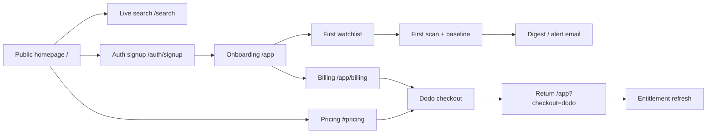

# GA Customer Journey Audit

Recorded 2026-06-24. **No behavior changes in Phase 1** — findings only.

## Journey map

## Surface audit

| Stage | Route / surface | Status | Findings |
|-------|-----------------|--------|----------|
| Discovery | `/` marketing | Live | "Early access" announcement pill; honest sample labeling |
| Trial | `/search` | Live | Read-only public search, no account |
| Signup | `/auth/signup` | Live | Better Auth email + OAuth |
| First value | `/app` dashboard + readiness | Live | Workspace readiness checklist |
| Monitoring | Watchlists | Live | Scout Monday-only; Starter/Agency daily |
| Billing | `/app/billing` | Live | Evidence usage, top-ups, portal link |
| Checkout | `POST /api/billing/dodo/checkout` | Live | SKU slug fail-closed; Agency held post-GA branch |
| Return | `/app?checkout=dodo` | Live | `CheckoutReturnBanner` polls plan activation |
| Pricing | `/#pricing` | Live | Dodo preview prices; Agency held badge when fan-out unproven |
| Status | `/status` | Live | Coarse blockers; no private canary data |
| Support | `/app/support`, `support@0509.io` | Live | Billing cases routed |

## Stale / beta / pilot copy inventory

| Location | Copy | Recommendation |
|----------|------|----------------|
| `app/routes/marketing.tsx` | "Early access" announcement | Phase 10: graduate to GA copy when gates pass |
| `app/routes/marketing.tsx` | Meta ads "marked beta" in honest note | Keep until Meta ads canary graduates |
| `app/lib/plan-entitlements.ts` | `metaSourceStatus: beta_*` | Product truth for Meta source lane |
| `app/routes/app.sources.tsx` | Meta ads beta readiness | Internal; not public marketing |
| `legacy/` | "Get early access" | Ignored — not in live build |
| `docs/launch-readiness.md` | "pilot-ready" verdict | Update after ops gates clear |
| `README.md` | Meta ads beta + pilot framing | Update in Phase 10 |

## Pricing honesty

- No hardcoded plan prices in entitlement or SKU catalog code.
- Marketing fallbacks say "Monthly price loading" until Dodo preview returns.
- Legacy `proof_500` bundle slugs map to v1 SKUs at checkout.

## Dead ends checked

| Path | Result |
|------|--------|
| Free user → watchlist over limit | Plan limit message + upgrade link |
| Paid downgrade over limit | Watchlists auto-pause |
| Checkout without SKU config | 503 from Dodo layer |
| Agency checkout before fan-out | Redirect `?checkout=agency-held` |
| Portal without Dodo customer id | `?portal=unavailable` banner |

## Gaps for GA (addressed in later phases)

- Agency public sale held until fan-out proof (Phase 8/9).
- Beta announcement on homepage deferred to Phase 10.
- Slack / uptime / portal remain owner-action (Phase 12).
