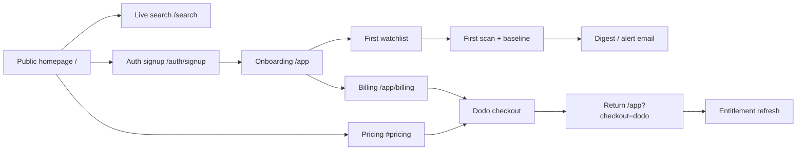

# GA Customer Journey Audit

Recorded 2026-06-24. **No behavior changes in Phase 1** — findings only.

> Historical audit. The current launch truth for the final hardening branch lives in
> `docs/final-self-serve-ga-scorecard.md`; use that file for current PR/deploy status.

## Journey map

## Surface audit

| Stage | Route / surface | Status | Findings |
|-------|-----------------|--------|----------|
| Discovery | `/` marketing | Live | "Early access" announcement pill; honest sample labeling |
| Trial | `/search` | Live | Read-only public search, no account |
| Signup | `/auth/signup` | Live | Better Auth email + OAuth |
| First value | `/app` dashboard + readiness | Live | Workspace readiness checklist |
| Monitoring | Watchlists | Live | Scout Monday-only; Starter/Agency daily |
| Billing | `/app/billing` | Live | Evidence usage, top-ups, portal link |
| Checkout | `POST /api/billing/dodo/checkout` | Live | SKU slug fail-closed; this historical branch still had Agency held pending fan-out proof |
| Return | `/app?checkout=dodo` | Live | `CheckoutReturnBanner` polls plan activation |
| Pricing | `/#pricing` | Live | Dodo preview prices; this historical branch still showed an Agency hold badge before fan-out proof |
| Status | `/status` | Live | Coarse blockers; no private canary data |
| Support | `/app/support`, `support@0509.io` | Live | Billing cases routed |

## Stale / beta / pilot copy inventory

| Location | Copy | Recommendation |
|----------|------|----------------|
| `app/routes/marketing.tsx` | "Early access" announcement | Superseded: the served homepage no longer shows this announcement |
| `app/routes/marketing.tsx` | Meta ads "marked beta" in honest note | GRADUATED 2026-08-12: canary green on the live worker (Gate C pass 2026-08-09, re-verified 2026-08-11); no beta caveat in served hero copy |
| `app/lib/plan-entitlements.ts` | `metaSourceStatus: beta_*` | GRADUATED 2026-08-12: renamed to `limited` / `priority`; product truth for Meta source lane |
| `app/routes/app.sources.tsx` | Meta ads beta readiness | Internal; not public marketing |
| `legacy/` | "Get early access" | Ignored — not in live build |
| `docs/launch-readiness.md` | "pilot-ready" verdict | Update after ops gates clear |
| `README.md` | Meta ads beta + old launch framing | GRADUATED 2026-08-12: README states the Meta ads beta caveat is lifted and gated on a green canary |

## Pricing honesty

- No hardcoded plan prices in entitlement or SKU catalog code.
- Marketing fallbacks say "Monthly price loading" until Dodo preview returns.
- Legacy `proof_500` bundle slugs map to v1 SKUs at checkout.

## Dead ends checked

| Path | Result |
|------|--------|
| Free user → watchlist over limit | Plan limit message + upgrade link |
| Paid downgrade over limit | Watchlists auto-pause |
| Checkout without SKU config | 503 from Dodo layer |
| Agency checkout before fan-out | Redirected `?checkout=agency-held` in this historical branch |
| Portal without Dodo customer id | `?portal=unavailable` banner |

## Gaps for GA (addressed in later phases)

- Agency public sale was held until fan-out proof in this historical branch; current truth lives in `docs/final-self-serve-ga-scorecard.md`.
- The old homepage beta announcement was removed in the final hardening branch; the Meta ads beta caveat was lifted 2026-08-12 after the production canary went green on the live worker (Gate C pass 2026-08-09, re-verified 2026-08-11). If the canary turns red, restore the beta caveat before any customer-facing Meta claim.
- Slack / uptime / portal remain owner-action (Phase 12).
