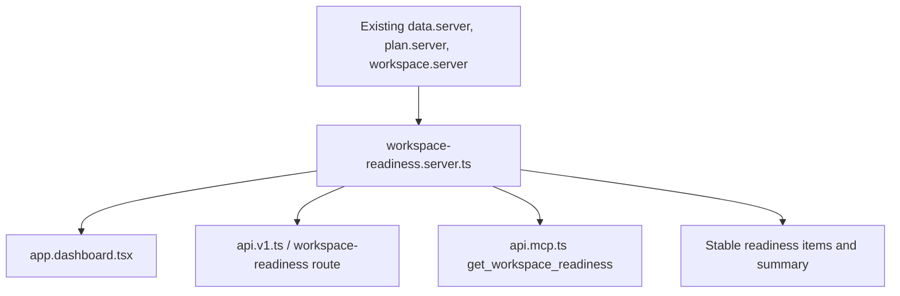

# feat: Add workspace readiness API and MCP context

## Summary

Create a shared workspace-readiness contract that the dashboard, customer API, and MCP endpoint can all use. This is the first narrow slice of the Competitor Desk Agent direction: before agents can safely operate a workspace, they need the same truthful readiness view a human sees in the app.

---

## Problem Frame

0509 already has a strong retained-value loop on the dashboard and read-only account exports through API/MCP. The readiness logic is still local to the dashboard view, so agents cannot ask one stable question like "is this workspace ready to monitor, prove, deliver, and report?" without reconstructing state from separate exports.

The product strategy is proof-backed competitor monitoring that agents can operate, not a generic chat surface. A reusable readiness object strengthens self-serve onboarding today and becomes the safe preflight layer for later write-capable agent tools.

---

## Requirements

**Readiness Contract**

- R1. The app exposes one server-side readiness builder that summarizes first competitor, first watchlist, first proof, first digest, delivery, billing, team, source, API, and MCP readiness for an account.
- R2. Each readiness item includes status, customer-facing label, short detail, recommended action, and an app path when there is a safe human action.
- R3. The readiness contract must avoid exposing secrets, API keys, Slack webhook URLs, customer tokens, internal auth config, or private provider state.

**Product Surfaces**

- R4. The dashboard uses the shared readiness object instead of maintaining a separate readiness checklist.
- R5. The customer API documents and serves a read-only `/api/v1/workspace-readiness` endpoint for the API-key account.
- R6. The MCP server exposes a read-only `get_workspace_readiness` tool with the same structured content and no write capability.

**Proof And Trust**

- R7. Delivery readiness distinguishes "configured" from "successful proof exists" so Slack and email claims stay honest.
- R8. Billing readiness reflects plan/proof-credit state without initiating checkout, plan changes, or portal actions.
- R9. Tests cover the server builder, customer API response, MCP tool response, and dashboard use of the shared readiness shape.

---

## Key Technical Decisions

- KTD1. Shared server module, not route-local helpers: readiness belongs in `app/lib/workspace-readiness.server.ts` so app routes, API routes, and MCP tools share the same truth.
- KTD2. Read-only first slice: this plan does not add write APIs, write MCP tools, delivery mutations, billing mutations, team invites, or watchlist actions. Those need explicit approval gates and audit logs in a later plan.
- KTD3. Use existing data access functions: the builder should compose current APIs such as `listWatchlists`, `listDeliveryTargets`, `listDigests`, `listRecentWorkspaceProofCaptures`, `getProofUsageSummary`, `getUserPlanBillingInfo`, `getCustomerMetaConnection`, and `listWorkspaceMembers` rather than adding schema.
- KTD4. Public shape is stable and conservative: readiness returns statuses and next actions, not raw database records. This protects future clients from internal table changes and keeps sensitive provider details out of agent context.
- KTD5. Dashboard remains the visual control panel: this change should reduce duplicate readiness calculations while preserving the current retained-value loop and launch-safe copy.

---

## High-Level Technical Design

The builder is the only place that interprets account setup state. Product surfaces can format or subset the output, but they should not re-decide what counts as ready.

---

## Scope Boundaries

### In Scope

- A shared read-only readiness contract.
- Dashboard adoption of that contract.
- Customer API and MCP read exposure.
- Tests for account scoping, no-secret output, and delivery-proof honesty.

### Deferred to Follow-Up Work

- Write-capable MCP/API tools for watchlists, delivery targets, collections, reports, share links, billing, and team actions.
- Audit log schema for future agent writes.
- Workspace memory for muted patterns, per-client context, and response preferences.
- Counter-move brief generation.

### Outside This Product's Identity

- Generic AI chat that is disconnected from proof-backed monitoring.
- Claims that agents can manage unsupported channels or unverified third-party systems.
- Public write API positioning before approval gates and audit logs exist.

---

## System-Wide Impact

The change touches authenticated product state, customer API output, and MCP agent context. It must preserve API-key account scoping, keep MCP tools read-only, and avoid leaking operational secrets through readiness details.

---

## Implementation Units

### U1. Add Shared Readiness Builder

- **Goal:** Create the stable readiness contract and compute it from existing account-owned data.
- **Requirements:** R1, R2, R3, R7, R8
- **Dependencies:** None
- **Files:** Create `app/lib/workspace-readiness.server.ts`; create `tests/workspace-readiness.server.test.ts`.
- **Approach:** Build a `getWorkspaceReadiness(env, userId)` function that returns a summary and item list. Derive state from existing data functions and normalize statuses to `ready`, `needs_setup`, `needs_proof`, `attention`, or `not_applicable`.
- **Patterns to follow:** `app/lib/plan.server.ts`, `app/lib/resource-export.ts`, `tests/plan.server.test.ts`, `tests/delivery-target-public.test.ts`.
- **Test scenarios:** Happy path with watchlist, successful proof, sent digest, email delivery, API/MCP availability, and paid proof credits returns mostly ready. Edge path with a Slack target but no successful delivery returns `needs_proof`. Empty workspace returns setup actions without throwing. No returned JSON contains webhook URLs, API key material, auth secrets, or customer tokens.
- **Verification:** The new unit tests pass and the exported contract is plain JSON-safe data.

### U2. Adopt Readiness On Dashboard

- **Goal:** Replace route-local setup checklist decisions with the shared readiness object while keeping the current dashboard UX intact.
- **Requirements:** R4, R7, R8, R9
- **Dependencies:** U1
- **Files:** Modify `app/routes/app.dashboard.tsx`; update or add route coverage in `tests/app-rebuild.test.ts` or a focused dashboard route test if one exists during implementation.
- **Approach:** Load readiness alongside existing dashboard data or use the builder as the source for setup items. Keep value-loop cards and current copy, but stop duplicating readiness thresholds in the component.
- **Patterns to follow:** Existing dashboard loader structure and the retained value loop in `app.dashboard.tsx`.
- **Test scenarios:** Dashboard renders first competitor, first proof, delivery, billing, and team readiness from the shared shape. Slack without delivery proof still shows a proof-needed state. Billing awareness still points to Plan & billing without initiating checkout.
- **Verification:** Dashboard tests or render coverage prove the route consumes the shared readiness output.

### U3. Add Customer API Readiness Endpoint

- **Goal:** Let account-owned API clients fetch readiness directly.
- **Requirements:** R3, R5, R7, R8, R9
- **Dependencies:** U1
- **Files:** Modify `app/routes/api.v1.ts`; create or modify a route file for `/api/v1/workspace-readiness`; update `tests/api-v1.route.test.ts`.
- **Approach:** Reuse existing API-key authentication. Return `no-store` JSON for the authenticated API-key account. Update API docs so the endpoint is visible but still clearly read-only.
- **Patterns to follow:** `app/routes/api.v1.$resourceType.$resourceId.ts`, `tests/api-v1.route.test.ts`.
- **Test scenarios:** Valid API key returns account readiness. Missing or invalid API key returns the existing auth error. Response includes no secrets. API docs list `/api/v1/workspace-readiness` and do not claim write APIs.
- **Verification:** API route tests pass and the response is account-scoped.

### U4. Add MCP Readiness Tool

- **Goal:** Let agents ask for workspace readiness through the existing MCP endpoint.
- **Requirements:** R3, R6, R7, R8, R9
- **Dependencies:** U1
- **Files:** Modify `app/routes/api.mcp.ts`; update `tests/mcp.route.test.ts`.
- **Approach:** Add a `get_workspace_readiness` tool with read-only annotations and no arguments beyond optional format if the existing MCP style needs it. Use the same structured content as the API endpoint.
- **Patterns to follow:** Existing MCP tool list and tool-call dispatch in `app/routes/api.mcp.ts`.
- **Test scenarios:** MCP tool discovery includes `get_workspace_readiness` with `readOnlyHint: true`. Tool call returns structured readiness for the API-key account. Invalid args fail safely. The endpoint instructions still say write APIs are not live yet.
- **Verification:** MCP route tests pass and no write capability is exposed.

### U5. Run Focused Verification

- **Goal:** Confirm the slice is safe, typed, and does not regress existing public/API boundaries.
- **Requirements:** R9
- **Dependencies:** U1, U2, U3, U4
- **Files:** No production files expected.
- **Approach:** Run focused tests for workspace readiness, API v1, MCP, and dashboard coverage first. Then run typecheck. Escalate to the full suite if focused tests reveal cross-cutting issues.
- **Patterns to follow:** Existing npm scripts in `package.json`.
- **Test scenarios:** Typecheck passes. Focused tests pass. Existing read-only API/MCP boundary tests still pass.
- **Verification:** Record the exact checks run in the final implementation summary.

---

## Risks & Dependencies

- **Auth scoping risk:** API and MCP readiness must use the API-key account, not a passed user id or route param.
- **Truth drift risk:** Dashboard, API, and MCP must not keep separate definitions of readiness after this lands.
- **Secret exposure risk:** Delivery and API readiness must summarize configuration without returning actual target values when they are sensitive.
- **Launch-claim risk:** The feature must not imply Slack proof, write APIs, or unsupported channels are live when they are not.

---

## Sources / Research

- `MEMORY.md`
- `docs/launch-readiness.md`
- `app/routes/app.dashboard.tsx`
- `app/routes/api.v1.ts`
- `app/routes/api.v1.$resourceType.$resourceId.ts`
- `app/routes/api.mcp.ts`
- `tests/api-v1.route.test.ts`
- `tests/mcp.route.test.ts`
- Foreground checkout strategy note `docs/strategy/2026-06-18-agent-native-self-serve-benchmark.md`, used as an untracked strategy source for this plan.
