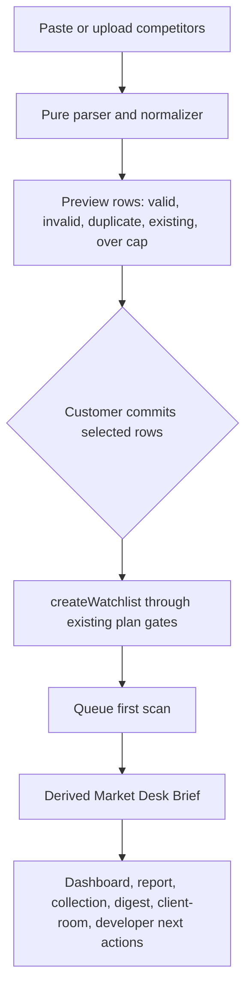
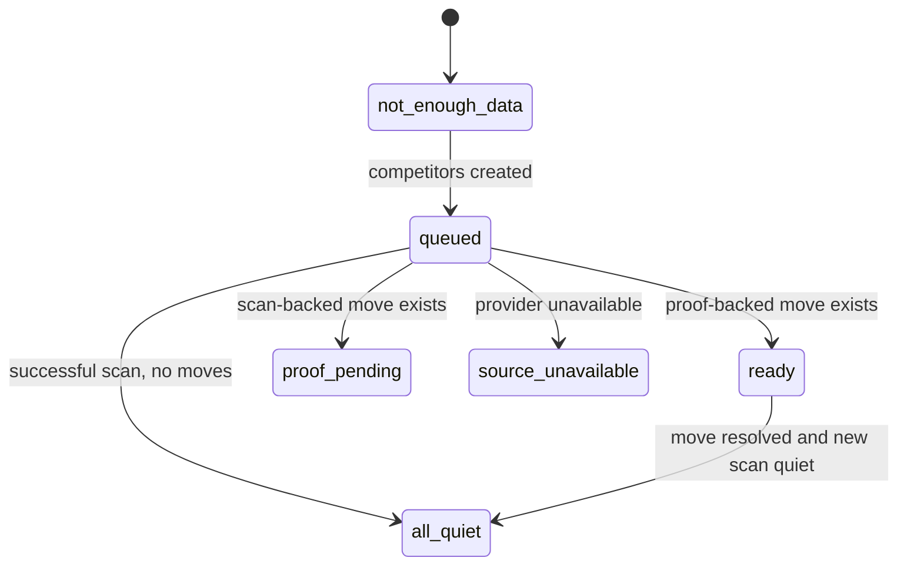

# feat: Market Desk first value loop

## Goal Capsule

| Field | Value |
| --- | --- |
| Objective | Turn setup, search, dashboard, reports, Agency, and Developer access into one Market Desk first-value loop. |
| Customer outcome | A paying customer can paste competitors, review normalized rows, create watchlists, and immediately see a truthful Market Desk Brief or queued state. |
| Authority | `docs/market-desk-experience-contract.md` defines product behavior. Existing auth, billing, proof, delivery, and plan gates remain authoritative. |
| Stop conditions | Stop instead of guessing if a change would mutate real payments/subscriptions, send unbounded customer notifications, change prices, enable held channels, or require unsupported provider data. |
| Execution profile | Deep, cross-surface product implementation; use small commits and focused tests per unit. |
| Tail ownership | The lead thread owns integration, review, PR, deploy, canaries, provenance, and worktree cleanup. |

---

## Product Contract

### Summary

Five to Nine should feel like a Market Desk, not a collection of features. The core journey is: choose plan, paste competitors, review the import, create watchlists and source next actions, generate a Market Desk Brief, then continue into proof review, report, digest, notifications, client room, or Developer access.

### Problem Frame

Current production truth is strong on raw capability: Dodo pricing and billing, Better Auth, watchlists, Search V2, Presence, proof capture, digests, reports, client rooms, support cases, API/MCP, and production canaries exist. The missing product layer is first-session activation for multi-competitor paid customers.

### Requirements

- R1. Paid onboarding invites customers to paste or upload multiple competitors, not start with one competitor by default.
- R2. Competitor import accepts domains, URLs, names, optional notes, and optional tags/client fields from pasted text or CSV.
- R3. Import preview classifies every row as valid, invalid, duplicate, existing, over cap, selected, or skipped before writing anything.
- R4. Import commit creates only selected valid rows, enforces plan caps, queues first scans, preserves onboarding progress, and reports partial success honestly.
- R5. MagicBrief migration copy is truthful: support generic competitor-list CSV/text import, and do not claim full MagicBrief data migration without a supplied export format.
- R6. Search presents an evidence-aware answer above results while preserving current result cards and verified-domain matching behavior.
- R7. Search answers never fabricate proof; exact domain no-result, broader-only, degraded provider, and partial data states are explicit.
- R8. The Market Desk Brief answers what changed, why it matters, proof status, source, and next action across the workspace.
- R9. Dashboard leads with the Market Desk Brief and next best step, then recent moves, source health, and actionable usage/plan warnings.
- R10. Reports and client-ready handoffs remain proof-strict; scan-backed and proof-pending states can appear as app review states only.
- R11. Agency setup supports 75-competitor bulk workflows and client/tag grouping without bypassing the existing fan-out checkout gate.
- R12. Developer access is framed as customer outcomes and approved actions, without internal tool-call language in primary UI.
- R13. Support, billing, and delivery copy stays truthful about provider-accepted email vs inbox delivery and support-backed fallbacks.
- R14. Non-sensitive activation/retention events use existing audit mechanisms where possible; no new analytics provider is introduced.

### Acceptance Examples

- AE1. Given a Starter workspace with zero watchlists, when the owner pastes 12 valid competitors, the preview shows 10 selectable rows and 2 over-cap rows before creation.
- AE2. Given a CSV with duplicate `www` and apex domains plus invalid rows, preview shows duplicates and invalids without silently dropping them.
- AE3. Given a free workspace, onboarding explains retained monitoring requires a paid plan and links to pricing.
- AE4. Given a domain search with verified ads, search shows repeated hooks/offers and recommends tracking the competitor.
- AE5. Given broader-only search results, search labels them as broader matches and recommends ignoring unless manually relevant.
- AE6. Given setup created watchlists but scans have not completed, dashboard shows a queued Market Desk Brief, not fake proof.
- AE7. Given confirmed proof-backed moves, dashboard shows top moves and report/collection next actions.
- AE8. Given an Agency workspace import with `client` tags, setup preserves grouping as review metadata and suggests client-room/report next actions.

### Scope Boundaries

- Do not add a durable brief table unless implementation proves a hard need; start with a derived document.
- Do not change Dodo prices, products, or subscription lifecycle behavior.
- Do not enable X, Reddit, LinkedIn, Slack, or WhatsApp publicly.
- Do not add migrations unless an unavoidable data model gap is verified.
- Do not build full MagicBrief data migration without real export samples.

---

## Planning Contract

### Key Technical Decisions

- KTD1. Use a shared import normalizer. Put parsing, CSV handling, dedupe, row status, and cap classification in a pure helper so onboarding and future import routes share behavior and route actions stay thin.
- KTD2. Keep watchlist creation through `createWatchlist`. It already dedupes active targets and ensures linked web mention targets; the importer should pre-classify duplicates so the UI does not mislabel existing rows as new.
- KTD3. Build Market Desk Brief as derived state. Compose from watchlists, watch events, proof classification, source/readiness, proof usage, recent runs, and follow-ups. Persist later only through existing report/share/client-room/audit paths.
- KTD4. Add search answer as a pure presentation helper over hydrated `SearchResponse`. Provider discovery, Search V2, and domain matching remain unchanged unless tests reveal a bug.
- KTD5. Use existing customer language and design systems. Logged-in surfaces stay Vercel-inspired and operational; public search keeps the current search layout with a compact answer block.
- KTD6. Treat MagicBrief as generic import. Official MagicBrief FAQ says reports can export CSV and Inspire collections have no bulk export; import copy must ask for a competitor list rather than promising a full data port.
- KTD7. Keep metrics privacy-safe. Use existing action/audit records or route tests where useful, but do not add an analytics provider or log raw import rows.

### High-Level Technical Design

### Assumptions

- Agency checkout remains controlled by the existing commercial launch gate.
- Presence source creation can remain a next action unless existing Presence APIs make safe bulk creation obvious during implementation.
- CSV upload can use `FormData` and `File.text()` with byte and row limits; no new dependency is required unless a tested parser proves insufficient.
- Existing route tests are enough for initial accessibility coverage, with browser QA added before shipping.

### Sources And Research

- `docs/market-desk-experience-contract.md` and `docs/market-desk-product-audit.md` define product behavior.
- `app/lib/competitor-website.ts`, `app/lib/search-query.ts`, and `app/lib/normalize.ts` define URL/domain/search normalization.
- `app/lib/plan-entitlements.ts` and `app/lib/plan.server.ts` define watchlist caps.
- `app/lib/counter-move-brief.server.ts`, `app/lib/proof-classification.ts`, `app/lib/report-builder.server.ts`, and `app/routes/app.dashboard.tsx` provide brief/report/dashboard patterns.
- Official MagicBrief FAQ: MagicBrief closes on July 31, 2026; Insights reports can export CSV; Inspire collections do not have a bulk export.

### System-Wide Impact

This changes first-value flows across onboarding, search, dashboard, reports, Agency, Developer access, tests, and docs. It must preserve auth/session ownership, workspace member behavior, plan caps, billing gates, proof/delivery truth, Search V2 matching, and Presence held-channel boundaries.

---

## Implementation Units

### U1. Competitor Import Parser And Preview

- **Goal:** Add a pure parser for pasted text and generic CSV competitor lists.
- **Requirements:** R1, R2, R3, R5, R11
- **Files:** `app/lib/competitor-import.ts`, `tests/competitor-import.test.ts`, optional shared CSV escaping helper if needed.
- **Approach:** Reuse `normalizeCompetitorWebsiteInput`, support headers such as `name`, `domain`, `url`, `website`, `notes`, `tags`, `client`, cap bytes/rows, neutralize formula-like values for exported output, and avoid logging raw rows.
- **Test Scenarios:** pasted one-domain-per-line; mixed name/domain lines; CSV with quoted commas; MagicBrief-like generic columns; invalid URL; duplicate `www`/apex rows; existing watchlist classification; over-cap rows; huge input rejected; formula-prefixed cells retained safely for UI and neutralized for export.
- **Verification:** Focused parser tests pass and no route writes happen during preview.

### U2. Bulk Market Desk Setup Route

- **Goal:** Replace one-by-one paid onboarding as the primary setup path while preserving the existing single-watchlist path where useful.
- **Requirements:** R1, R3, R4, R5, R11
- **Files:** `app/routes/app.onboard.tsx`, optional `app/routes/app.import.tsx`, `app/routes.ts`, `app/app.css`, `tests/onboarding.route.test.ts`, optional `tests/import.route.test.ts`.
- **Approach:** Add paste/upload preview and commit intents. Compute available slots from plan limit and active watchlists. Commit only selected valid rows; queue first scans; complete onboarding; return a success state or redirect into the Market Desk/dashboard with created counts.
- **Test Scenarios:** Scout 3; Starter 10; Agency 75 simulated; over-cap selection; invalid rows no write; duplicate rows no write; free plan upgrade CTA; member completes onboarding without owner writes; partial success; provider unavailable copy.
- **Verification:** Route tests prove preview no-write and commit behavior; existing onboarding tests still pass.

### U3. Market Desk Brief Builder

- **Goal:** Add a derived workspace-level Market Desk Brief that can power onboarding completion and dashboard.
- **Requirements:** R8, R9, R10
- **Files:** `app/lib/market-desk-brief.ts`, `app/lib/market-desk-brief.server.ts`, `tests/market-desk-brief.test.ts`, `tests/dashboard.route.test.ts`.
- **Approach:** Compose state from active/paused watchlists, recent events, proof classifications, recent scans, proof captures, source status, lifecycle nudges, and counter-move follow-ups. Keep output small and customer-safe.
- **Test Scenarios:** ready with top moves; queued after setup; all quiet; not enough data; no verified ads; source unavailable; proof pending; paused-only; partial proof; top 3 ordering.
- **Verification:** Builder tests cover every contract state and dashboard consumes the builder.

### U4. Dashboard Retention Loop

- **Goal:** Make Overview the Market Desk home and surface next best step/lifecycle nudges.
- **Requirements:** R8, R9, R13, R14
- **Files:** `app/routes/app.dashboard.tsx`, `app/lib/workspace-readiness.server.ts`, `app/lib/lifecycle-nudges.server.ts` if needed, `app/app.css`, `tests/dashboard-activation.route.test.ts`, `tests/dashboard.route.test.ts`, `tests/workspace-readiness.server.test.ts`.
- **Approach:** Replace raw setup-first hierarchy with Market Desk Brief first, then top moves/all-quiet, follow-ups, source health, lifecycle nudges, and only actionable usage/billing warnings. Tighten email copy to "send recorded" or "provider accepted" where relevant.
- **Test Scenarios:** new paid workspace; configured workspace; queued first scan; all quiet; multiple moves; proof pending; source failure; plan limit warning; payment issue; mobile layout snapshot/static assertions where available.
- **Verification:** Focused dashboard/readiness tests pass and browser QA checks desktop/mobile text fit.

### U5. Evidence-Aware Search Answer

- **Goal:** Add a customer-facing answer summary above search results.
- **Requirements:** R6, R7
- **Files:** `app/lib/search-answer.ts`, `app/routes/search.tsx`, `app/app.css`, `tests/search-answer.test.ts`, `tests/search.route.test.ts`, `tests/search-rebuild.test.ts`.
- **Approach:** Summarize verified count, hooks, offers, landing-page signals, formats, newest ads, watch/ignore recommendation, confidence, source coverage, and next actions from hydrated results. Broader-only and degraded states must downgrade confidence.
- **Test Scenarios:** verified domain summary; no verified results; broader-only results; Okara-style false positives excluded; long ad copy; provider degraded/cache-only; missing landing-page signals; authenticated CTA; mobile answer block.
- **Verification:** Search-focused tests pass without changing provider/domain matching tests.

### U6. Report, Client Room, Agency, And Developer Framing

- **Goal:** Turn the brief into customer outcomes across reports, client rooms, Agency setup, and Developer access without exposing internal terms.
- **Requirements:** R10, R11, R12
- **Files:** `app/routes/app.clients.tsx`, `app/routes/app.sources.tsx`, `app/lib/agent-action-catalog.ts`, `app/routes/api.docs.tsx`, `app/routes/api.mcp.ts`, `tests/clients.route.test.ts`, `tests/sources.route.test.ts`, `tests/mcp.route.test.ts`, `tests/api-v1.route.test.ts`.
- **Approach:** Add brief/report/client-room next actions, keep Agency checkout gate intact, frame API/MCP as Developer access and approved actions, and hide unavailable actions from primary UI.
- **Test Scenarios:** Agency held vs open; internal Agency fixture; client grouping copy; team invite CTA; API/MCP CTA; no checkout bypass; no internal tool-call language.
- **Verification:** Focused route/API tests pass and public docs stay truthful.

### U7. Self-Serve Trust, Account Controls Review, And Metrics

- **Goal:** Reduce paid-customer friction without inventing unsupported provider capabilities.
- **Requirements:** R13, R14
- **Files:** `docs/account-controls-salvage-review.md`, `app/routes/app.billing.tsx`, `app/routes/app.support.tsx`, `app/routes/app.account.tsx`, existing support/billing tests as needed.
- **Approach:** Review `codex/0509-saas-account-controls-20260622` for already-shipped, salvageable, deferred, unsafe, and obsolete commits. Apply only safe unique improvements. Add privacy-safe activation/retention audit events only through existing mechanisms.
- **Test Scenarios:** billing portal available/unavailable copy; cancellation/support fallback; account deletion request; support case status; setup completed event bucket; no sensitive values logged.
- **Verification:** Salvage doc exists; focused account/support/billing tests pass.

### U8. Verification, Review, PR, Deploy, Provenance, Cleanup

- **Goal:** Ship through the repo's protected path with proof and no branch/worktree clutter.
- **Requirements:** All
- **Files:** `docs/market-desk-first-value-progress.md`, PR body docs if needed.
- **Approach:** Run focused tests after each unit, full gates before PR, CE review, autoreview, Bugbot gate as configured, protected PR, merge, remote migration check/apply only if needed, deploy, production canaries, and cleanup.
- **Test Scenarios:** Full launch/readiness gate; browser QA desktop/mobile; canaries; post-deploy health/search/billing/proof proof.
- **Verification:** Progress doc records commands, canaries, blockers, owner actions, deployment, rollback, and cleanup.

---

## Verification Contract

| Gate | Applies To | Done Signal |
| --- | --- | --- |
| Focused unit tests | Each implementation unit | Relevant new/changed tests pass before moving on |
| `npm test` | Full branch | All Vitest tests pass |
| `npm run typecheck` | Full branch | Cloudflare types, React Router types, and TypeScript pass |
| `npm run build` | Full branch | Production build passes |
| `node scripts/validate-d1-backup.mjs` | Release tail | Backup validator passes |
| `SAFE_DEPLOY_APPROVED=d1 npx wrangler d1 migrations list 0509 --remote` | Release tail | No unexpected pending migrations |
| `git diff --check` | Every commit and final branch | No whitespace errors |
| Safe canaries | Release tail | Pricing, billing, proof, prod canaries pass; Presence either passes or remains recorded owner-action blocker |
| Browser QA | User-visible UI | Desktop and mobile flows render without overlap and text remains customer-facing |
| `ce-code-review` and `autoreview` | Before PR/merge/deploy | No accepted/actionable findings remain |

---

## Definition of Done

- Bulk paid setup/import is available, tested, plan-aware, and does not silently drop rows.
- MagicBrief migration copy is truthful and source-backed.
- Market Desk Brief appears immediately after setup and at the top of Overview with honest ready, queued, all-quiet, not-enough-data, source-unavailable, no-verified-ads, proof-pending, and plan-cap states.
- Search presents an evidence-aware answer summary and keeps existing result/detail behavior.
- Agency, client room, Developer access, support, billing, and delivery surfaces use customer language and preserve existing gates.
- Reports remain proof-strict and do not promote scan-backed items as client-ready proof.
- Non-sensitive activation/retention accounting is added only through existing mechanisms or documented as deferred.
- Required docs are updated: product audit, experience contract, progress/provenance, account-controls salvage review if needed.
- Full verification, review, PR, deploy, canaries, rollback note, provenance, and worktree cleanup are complete.
