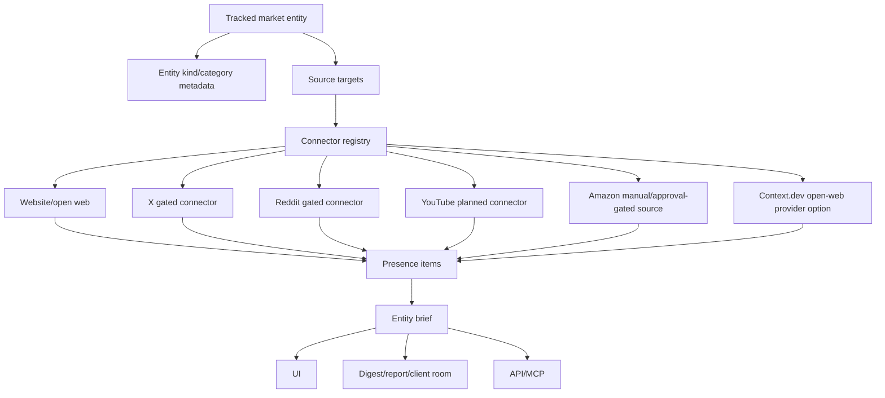
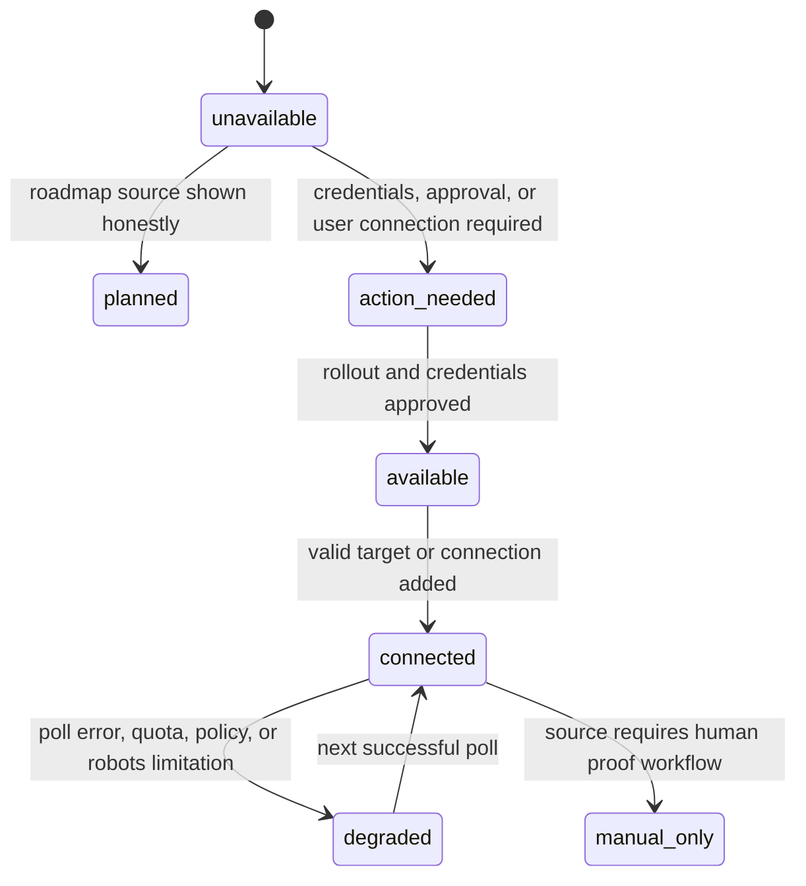

# feat: Presence Desk pivot

## Goal Capsule

| Field | Value |
| --- | --- |
| Objective | Pivot 0509 from competitor-first Market Desk language into proof-backed tracking for any market entity while reusing the existing Presence Tracking architecture. |
| Customer outcome | A customer can track themselves, competitors, brands, creators, products, or clients across declared sources, then see what changed, where it came from, proof strength, and the next useful action. |
| Authority | Nish's pivot direction, the pressure-test outcome, `docs/presence-tracking-architecture.md`, `docs/market-desk-experience-contract.md`, current repo behavior, and official source-provider rules. |
| Stop conditions | Stop instead of guessing if implementation would claim unsupported source coverage, bypass platform terms, scrape Amazon generically, expose source credentials, mutate billing/prices, or replace working proof/digest behavior without stronger evidence. |
| Execution profile | Product pivot plus focused implementation slice. Codex plans and verifies; implementation should run through the guarded Cursor/Composer lane unless Nish explicitly approves direct Codex implementation. |
| Tail ownership | Lead thread owns review, verification, PR/merge/deploy decisions, and worktree cleanup. |

---

## Product Contract

### Summary

0509 becomes a proof-backed tracking system for market entities, not a generic "scan the internet" tool.

The public promise should move toward: "Track any market entity. See what changed, with proof. Know what to do next."

"Any" means any customer-defined market entity type, not every internet source on day one. Source coverage must be explicit, honest, and gated by official APIs, approved providers, or manual proof workflows.

### Problem Frame

Customers do not only track competitors. They track their own brand, a client, a product, a creator, a founder, a campaign, or a market category. The current repo already has the right underlying shape through Presence Tracking: `tracked_entity`, `source_target`, connector coverage labels, normalized `presence_item` records, digests, and a Presence UI. The product gap is framing, source coverage clarity, and a first slice that proves entity tracking across the web without overpromising platform access.

### Requirements

- R1. The product language describes proof-backed entity tracking, not only competitor monitoring and not generic internet scanning.
- R2. A tracked entity can represent self, competitor, brand, client, product, creator, founder, campaign, or category without breaking existing `self` and `competitor` tracking modes.
- R3. Each tracked entity has visible source targets with connector, target, rollout status, coverage label, latest observed item, last poll state, and any action needed from the user.
- R4. Source coverage is presented as a matrix: available, connected, limited, unavailable, planned, or manual proof only.
- R5. Website/open-web coverage remains the first GA source and uses safe fetch, robots handling, bounded responses, and proof labels already in Presence.
- R6. X, Reddit, YouTube, and similar social/community platforms are connector-gated by credentials, official API access, quota, and rollout state.
- R7. Amazon and marketplace tracking are not launched as automated generic scraping. First slice may support manual marketplace proof capture or approved affiliate/product API experiments only after legal/product review.
- R8. Context.dev, if used, is an optional provider for open-web crawling, page extraction, screenshots, brand/page enrichment, or fallback discovery. It is not the product architecture and not a platform-policy bypass.
- R9. Entity briefs answer: what changed, why it matters, where it happened, proof strength, source coverage, confidence, and recommended next action.
- R10. Digests, reports, API, MCP, and developer-facing surfaces expose the same truthful entity/source/proof model as the UI.
- R11. Unsupported or degraded source states must be explicit. The app must never fabricate proof, imply inbox delivery when only provider acceptance is known, or imply platform coverage that is not enabled.
- R12. The pivot preserves existing billing, auth, workspace, proof, delivery, Presence entitlement, and readiness gates.

### Actors

- A1. Workspace owner or marketer tracking their own brand and market.
- A2. Agency user tracking clients, client competitors, products, and campaigns.
- A3. Developer or agent consuming 0509 through API/MCP.
- A4. Source provider such as website/RSS, Context.dev, X, Reddit, YouTube, Amazon, or a manual proof workflow.
- A5. Client or stakeholder receiving reports, rooms, or digests.

### Key Flows

- F1. Create entity: user adds a brand, competitor, product, creator, client, or campaign and chooses whether it is "ours", "competitor", or another visible category.
- F2. Review coverage: app shows which sources are connected, available, limited, unavailable, or manual-only for that entity.
- F3. Add sources: user adds website/open-web targets first; gated social sources only appear when policy, credentials, and rollout allow them.
- F4. Poll and normalize: connector validates the target, polls safely, writes normalized `presence_item` records, and records cursor/error/proof metadata.
- F5. Brief and act: entity brief turns items into changes, proof strength, source confidence, and next actions.
- F6. Share or automate: digest, report, client room, API, or MCP action reflects the same proof-backed state.

### Acceptance Examples

- AE1. Given a user tracks their own brand website, the entity detail page shows website/open-web as connected or available, recent proof-backed changes, and the latest poll state.
- AE2. Given a user tracks a competitor with X disabled in production, X appears as unavailable or planned, not as an active scan source.
- AE3. Given Reddit credentials or commercial access are missing, Reddit shows the source action needed and does not silently fall back to unapproved scraping.
- AE4. Given YouTube is planned but no API key/quota is configured, YouTube is visible in docs/source coverage only as planned or unavailable.
- AE5. Given a user wants Amazon tracking, the first product surface offers manual proof or "requires approval" language, not automated marketplace scanning.
- AE6. Given a source poll fails because robots or provider policy blocks access, the item is not invented and the entity brief names the source limitation.
- AE7. Given Context.dev is configured, it can enrich open-web/page extraction, but platform sources still retain their own official coverage states.
- AE8. Given an API/MCP consumer lists tracked entities, the response includes source coverage/proof state and excludes unavailable actions from the primary action list.

### Scope Boundaries

In scope for the first implementation slice:

- Rename and reposition the product surface around proof-backed entity tracking.
- Add entity kind/category metadata in a backward-compatible way.
- Add a source coverage matrix and proof policy shared by UI, digests, API, and MCP docs.
- Make the existing Presence UI the implementation base for the pivot.
- Add open-web/provider extension points where they fit existing safe-fetch and connector contracts.
- Add planned/manual source states for YouTube and Amazon without claiming automated coverage.
- Keep existing competitor/Market Desk flows working during the transition.

Deferred:

- Full YouTube ingestion, until API key, quota, and product scope are approved.
- X production rollout, until paid API credentials and rate limits are explicitly approved.
- Reddit production rollout, until commercial access and credentials are approved.
- Amazon automated marketplace monitoring, until terms, use case, affiliate/product API fit, and legal/product review are complete.
- Context.dev paid usage, until pricing, reliability, and data-retention requirements are approved.
- Large-scale social listening, semantic entity resolution, and cross-source auto-merge.

Out of scope:

- A generic crawler that promises "scan the whole internet."
- Hidden scraping that bypasses platform rules.
- Raw data dumping without proof, confidence, and next action.
- Launch copy that lists unavailable sources as active features.

### Dependencies

- Existing Presence migrations and code: `migrations/0055_presence_tracking.sql`, `migrations/0059_presence_domain_verification.sql`, `app/lib/presence-types.ts`, `app/lib/presence-connector-registry.server.ts`, and `app/routes/app.presence*.tsx`.
- Existing proof, digest, report, API, and MCP surfaces.
- Official provider docs and access rules for YouTube, Reddit, X, Amazon, and Context.dev.
- Repo gates: `npm test`, `npm run typecheck`, `npm run build`, `npm run canary:presence`, and `npm run launch:readiness`.

### Sources And Research

- `docs/presence-tracking-architecture.md` already defines self/competitor Presence, coverage labels, connector rollouts, safe fetch, robots handling, digests, and current production rollout.
- `docs/market-desk-experience-contract.md` defines the current Market Desk promise that this pivot must preserve where it still creates value.
- Context.dev docs: <https://docs.context.dev/>
- Context.dev pricing: <https://www.context.dev/pricing>
- YouTube Data API search/list docs: <https://developers.google.com/youtube/v3/docs/search/list>
- YouTube quota docs: <https://developers.google.com/youtube/v3/determine_quota_cost>
- Reddit developer docs and policy entrypoint: <https://developers.reddit.com/docs/>
- X API docs: <https://docs.x.com/x-api/introduction>
- Amazon Product Advertising API docs: <https://webservices.amazon.com/paapi5/documentation/>
- Amazon Product Advertising API license terms: <https://webservices.amazon.com/paapi5/documentation/license-agreement.html>

---

## Planning Contract

### Key Technical Decisions

- KTD1. Reuse Presence Tracking instead of creating a separate scanner. The existing `tracked_entity`, `source_target`, `source_connection`, `presence_item`, and coverage-label model is the right base.
- KTD2. Keep `tracking_mode` stable for now. Do not destructively replace `self | competitor`; add visible entity category/kind metadata around it so old flows keep working.
- KTD3. Treat source coverage as a first-class product object. UI, digests, API, MCP, docs, and readiness should all read from one source coverage policy, not duplicate copy.
- KTD4. Build connector shells and unavailable states before enabling new sources. YouTube and Amazon can appear as planned/manual states only until credentials and approval exist.
- KTD5. Keep Context.dev provider-scoped. It can support open-web crawling/extraction/screenshots/brand enrichment through backend-only code, but it cannot be used from the browser and cannot stand in for official platform APIs.
- KTD6. Use proof tiers, not source hype. The product should rank verified connected account, official public API, verified public feed, public web best effort, manual proof, limited, and unavailable states honestly.
- KTD7. Preserve launch gates. No billing, auth, deploy, delivery, or provider rollout gate weakens as part of the pivot.

### High-Level Technical Design

### System-Wide Impact

This is a product identity pivot over an existing architecture. It touches naming, navigation, onboarding, Presence UI, source policy, digest/report copy, API/MCP discoverability, docs, and readiness tests. It should not change auth, billing, payment lifecycle, workspace ownership, or delivery semantics unless a specific unit proves a narrow bug.

### Implementation Constraints

- Backend-only provider calls. Context.dev, source credentials, Cloudflare, D1, R2, KV, model providers, and platform API secrets must never be called from client code.
- No unsupported source claims. Any visible source list must separate active, gated, planned, manual, and unavailable states.
- No auto-merge by name similarity. Preserve Presence v1's verified-link principle unless a later plan covers entity resolution.
- Safe fetch remains mandatory for open-web targets: SSRF guard, robots handling, bounded responses, and product token.
- Existing customers must not lose competitor monitoring language abruptly; copy can say competitors are one tracked entity type.

### Sequencing

1. Product contract and docs.
2. Shared entity/source vocabulary.
3. Source coverage policy and UI matrix.
4. Presence UI repositioning.
5. Provider connector shells and optional open-web provider hook.
6. API/MCP/digest/report parity.
7. Verification and launch-readiness gates.

---

## Implementation Units

### U1. Product Vocabulary And Docs Contract

- **Goal:** Establish the pivot in repo docs without overclaiming active source coverage.
- **Requirements:** R1, R4, R7, R8, R11, R12
- **Files:** `README.md`, `docs/market-desk-experience-contract.md`, new `docs/presence-desk-experience-contract.md`, `docs/presence-tracking-architecture.md`, relevant public docs generated from `app/lib/public-markdown.ts`.
- **Approach:** Introduce "Presence Desk" or equivalent proof-backed entity tracking language. Keep Market Desk as the competitor-focused workflow within the broader product. Add a source coverage table with active, gated, planned, manual, and unavailable states. Remove or soften any copy that implies active Amazon/YouTube/X/Reddit scanning before provider gates are satisfied.
- **Test Scenarios:** Public docs do not claim unavailable sources; competitor flows are still described; source coverage table matches production rollout; manual/approval-gated marketplace language is present.
- **Verification:** Documentation diff review plus static copy checks where existing test harness supports them.

### U2. Entity Kind Metadata

- **Goal:** Allow "track anything" at the entity layer without breaking `self | competitor` mode semantics.
- **Requirements:** R2, R3, R12
- **Files:** New migration such as `migrations/0062_presence_entity_kind.sql`, `app/lib/presence-types.ts`, `app/lib/presence-data.server.ts`, `app/routes/app.presence*.tsx`, focused Presence tests.
- **Approach:** Add a backward-compatible `entity_kind` or metadata-backed category with values such as `self_brand`, `competitor`, `client`, `product`, `creator`, `founder`, `campaign`, and `category`. Keep `tracking_mode` for permission/source behavior. Default old competitor rows to `competitor` and old self rows to `self_brand`.
- **Test Scenarios:** Existing rows read with defaults; new entity kind saves and displays; invalid kind is rejected; self/competitor gating still follows `tracking_mode`; account deletion and soft-delete cascades are unchanged.
- **Verification:** Migration test if available, data helper tests, route action tests, and `npm run typecheck`.

### U3. Source Coverage Policy

- **Goal:** Centralize source coverage state so UI, docs, digests, API, and MCP cannot drift.
- **Requirements:** R3, R4, R6, R7, R8, R10, R11
- **Files:** New `app/lib/presence-source-coverage.server.ts` or shared module, `app/lib/presence-types.ts`, `app/lib/presence-connector-registry.server.ts`, source docs tests, route/API tests.
- **Approach:** Define source availability from connector rollout, credentials, policy flags, entity mode, and manual-only restrictions. Add statuses for active, available, gated, planned, manual-only, limited, and unavailable while mapping to existing coverage labels where needed.
- **Test Scenarios:** Website GA; X disabled; Reddit missing commercial access; LinkedIn self-only; YouTube planned/no credentials; Amazon manual-only; Context.dev configured/unconfigured; unknown source rejected.
- **Verification:** Focused policy tests prove each source state and no UI/API call hand-rolls source availability.

### U4. Presence UI Repositioning

- **Goal:** Turn `/app/presence` into the first visible embodiment of proof-backed entity tracking.
- **Requirements:** R1, R2, R3, R4, R5, R9, R11
- **Files:** `app/routes/app.presence.tsx`, `app/routes/app.presence.$entityId.tsx`, related CSS/components, Presence route tests.
- **Approach:** Update labels from "self/competitor tracking" to tracked market entities. Add entity kind selection, source coverage matrix, last-change/last-poll summary, proof state, and next action. Keep current entitlement gates and hidden social-connect behavior when rollouts are disabled.
- **Test Scenarios:** Empty state; entity list with multiple kinds; entity detail with website GA source; disabled social sources hidden or marked unavailable according to product decision; source poll failure; mobile layout text fit.
- **Verification:** Route tests plus browser QA for desktop/mobile if the dev server is needed.

### U5. Entity Brief Builder

- **Goal:** Generate a concise proof-backed brief for any tracked entity.
- **Requirements:** R3, R5, R6, R9, R10, R11
- **Files:** New `app/lib/presence-entity-brief.server.ts`, digest/report integration points, route tests, digest tests.
- **Approach:** Build derived state from active source targets, recent `presence_item` records, poll cursor health, coverage state, proof labels, and source confidence. Return explicit states such as not enough data, queued, all quiet, ready, source unavailable, manual proof needed, and degraded.
- **Test Scenarios:** New entity with no sources; website source queued; all quiet; recent changes; source degraded; manual-only Amazon proof; Context.dev-enriched open-web item; unavailable YouTube.
- **Verification:** Builder tests cover every state and one UI/API consumer consumes the builder instead of duplicating logic.

### U6. Provider Adapter Shells And Open-Web Provider Option

- **Goal:** Prepare source expansion without launching unsupported scanning.
- **Requirements:** R5, R6, R7, R8, R11
- **Files:** `app/lib/presence-connectors/*.server.ts`, `app/lib/presence-connector-registry.server.ts`, env/readiness docs, tests.
- **Approach:** Add connector shells or policy entries for YouTube and Amazon that validate as planned/manual-only/unavailable until approval. Add a backend-only Context.dev provider wrapper only if it fits existing env and fetch patterns; otherwise document it as a later provider task. Do not call Context.dev from browser code. Do not enable paid API use by default.
- **Test Scenarios:** YouTube target cannot poll without credentials; Amazon generic URL returns manual-only/approval-required; Context.dev absent means open-web still works through existing website connector; provider secrets are never serialized to client props.
- **Verification:** Connector registry/policy tests plus secret-leak grep for provider env names in client bundles where practical.

### U7. API, MCP, Digest, Report, And Client-Room Parity

- **Goal:** Make the pivot agent-native and customer-facing without divergent claims.
- **Requirements:** R9, R10, R11, R12
- **Files:** `app/lib/agent-action-catalog.ts`, `app/routes/api.mcp.ts`, API v1 routes, `app/lib/presence-digest.server.ts`, report/client-room surfaces, docs tests.
- **Approach:** Expose tracked entities, source coverage, proof state, and allowed next actions. Hide unavailable actions or label them as unavailable with reasons. Keep primary UI and API language customer-facing, not internal tool-call language.
- **Test Scenarios:** MCP lists entity and source states; unavailable source actions absent or disabled; digest includes source limitation honestly; report/client room shows proof-backed changes and not planned-source claims.
- **Verification:** Focused API/MCP/digest tests and public markdown/doc tests.

### U8. Readiness, Review, And Launch Gate

- **Goal:** Ship the pivot through the repo's real gates.
- **Requirements:** All
- **Files:** `docs/presence-pivot-progress.md`, readiness scripts/tests as needed.
- **Approach:** Track implementation evidence in a progress doc. Run focused tests per unit, then full tests/build/readiness. Run CE review, fix accepted findings, run `autoreview`, and only then consider PR/merge/deploy. If paid external provider use is needed, stop for explicit Nish approval.
- **Test Scenarios:** Full test suite; typecheck; build; presence canary; launch readiness; browser QA for changed UI; source-claim audit across public copy.
- **Verification:** No branch is considered shippable until all gates in the Verification Contract pass or the blocker is explicitly recorded.

---

## Verification Contract

| Gate | Applies To | Done Signal |
| --- | --- | --- |
| Focused unit/route tests | Each implementation unit | New and changed tests for the active unit pass before moving to the next unit. |
| `npm test` | Full branch | Full Vitest suite passes. |
| `npm run typecheck` | Full branch | TypeScript and generated framework types pass. |
| `npm run build` | Full branch | Production build passes. |
| `npm run canary:presence` | Presence behavior | Presence canary passes against the configured environment, or a real missing-env blocker is recorded. |
| `npm run launch:readiness` | Release candidate | Top-level readiness gate passes before PR/merge/deploy. |
| Browser QA | Changed UI | Presence/entity screens render without text overlap on desktop and mobile. |
| Source-claim audit | Public copy, UI, docs, API/MCP | No unavailable or planned source is presented as active coverage. |
| CE review and `autoreview` | Pre-merge/ship path | Accepted/actionable findings are fixed and the review reruns clean. |
| `git diff --check` | Every final diff | No whitespace errors. |

Provider-specific verification:

- YouTube: official API credentials and quota behavior must be verified before any active YouTube ingestion claim.
- Reddit: commercial/API access and credential posture must be verified before production rollout.
- X: paid API credentials, endpoint rate limits, and cost posture must be verified before production rollout.
- Amazon: terms/product fit and explicit approval are required before any automated marketplace monitoring.
- Context.dev: backend-only integration, pricing/credit impact, retention expectations, and failure modes must be verified before paid-provider use.

---

## Definition of Done

- The product has a single truthful positioning contract: proof-backed tracking for market entities across declared sources.
- Existing competitor tracking still works as a supported entity type.
- Entity kind/category exists without breaking `tracking_mode` source behavior.
- Source coverage is centralized and reused by UI, docs, digests, API, and MCP.
- Website/open-web remains the first active source; social/community/marketplace sources are gated, planned, manual-only, or unavailable unless provider approval is proven.
- Context.dev is either not implemented yet or implemented only as a backend open-web provider option with explicit env/config gates.
- Entity briefs show changes, proof, source confidence, and next actions without fabricated data.
- Public copy, app UI, docs, API, and MCP do not overclaim Amazon, YouTube, X, Reddit, or Context.dev coverage.
- Focused tests, `npm test`, `npm run typecheck`, `npm run build`, `npm run canary:presence`, and `npm run launch:readiness` pass or a real blocker is recorded.
- Browser QA covers the changed Presence/entity UI on desktop and mobile.
- Review gates run before ship: CE code review, accepted-finding fixes, and `autoreview`.
- Any dead-end implementation experiments are removed before PR/merge/deploy.
- The worktree is cleaned up after the branch is merged, discarded, or explicitly preserved with a blocker and next action.

---

## Implementation Handoff

Use this plan as the authority. Start by reading `docs/presence-tracking-architecture.md`, then inspect the current Presence routes, connector registry, and types. Implement units in order unless a narrower dependency becomes obvious. Do not enable or claim provider coverage before the relevant official access, credentials, rollout state, and verification are in place.

Recommended first build slice:

1. U1 Product Vocabulary And Docs Contract.
2. U3 Source Coverage Policy.
3. U4 Presence UI Repositioning.
4. U5 Entity Brief Builder for website/open-web only.

That slice is enough to make the pivot real without waiting on Amazon, YouTube, X, Reddit, or Context.dev.
